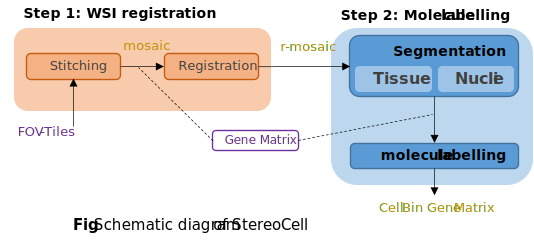

# StereoCell
StereoCell is a tool for generating single-cell gene expression data

<br><br>

## Installation

- pipeline

It supported on Stitching, Tissue segmentation, Cell segmentation and Cell labelling. Easy installation based on ```python==3.8``` like,
```text
pip install -r requirements.txt
```
If you need run the segmentation module, download the weights files first, then modify the file -> [weights.json](./stereocell/segmentation/weights.json). Model zoo,

|       Function       | ML framework | resolution |                     Download                     |
|:--------------------:|:------------:|:----------:|:------------------------------------------------:|
|  Cell segmentation   |     onnx     |    256     | [.onnx](https://pan.genomics.cn/ucdisk/s/JvyUze) |
| Tissue segmentation  |     onnx     |    512     | [.onnx](https://pan.genomics.cn/ucdisk/s/f6VJve) |

- manual tool on _Windows_

It supported on Stitching, Registration, Tissue segmentation and Single cell data visulization. 
 Please download the [installation package](https://pan.genomics.cn/ucdisk/s/FZB3Qf) first, and follow the tutorial step by step. More detail refer [this](https://gitlab.genomics.cn/biointelligence/implab/stero-rnd/advancedtools/cellbin-studio).

## Usage
We recommend using Manual tool to complete Stitching & Registration module, and Pipeline to complete Segmentation & Cell labelling module
- [Sample Data](https://pan.genomics.cn/ucdisk/s/ERVbey)  ```Image(FOV tiles, 3X3) and GeneMatrix```
 
- Manual tool

Refer the [tutorial](https://gitlab.genomics.cn/biointelligence/implab/stero-rnd/advancedtools/cellbin-studio) step by step
- About pipeline
<details close>
<summary> Segmentation & Cell Labelling </summary>

```shell
python .\cell_bin.py \
--image_path D:\code\mine\github\StereoCell\data\SS2000_regist.tif \
--matrix_path D:\code\mine\github\StereoCell\data\SS2000.gem.gz  \
--out_path D:\code\mine\github\StereoCell\data
```
</details>

<details close>
<summary> Stitching </summary>

In shell
```shell
python .\correct.py \
--input D:\\code\\mine\\github\\StereoCell\\data \
--output D:\\code\\mine\\github\\StereoCell\\data \
--overlap 0.12
```
or in script
```python
import stitch

input = 'D:\StereoCell\data\gene.gem.gz'
output = 'D:\StereoCell\data\cell_mask.tif'
stitch.stitch(input, output, overlap=0.12)
```
</details>

<details close>
<summary> Segmentation </summary>

In shell

``` cell segmentation
python .\cell.py \
--input D:\StereoCell\data\image_6467_16800_512_512.tif \
-output D:\StereoCell\data\image_cell.tif \
```
or 
``` tissue segmentation
python .\tissue.py \
--input D:\StereoCell\data\image_6467_16800_512_512.tif \
-output D:\StereoCell\data\image_tissue.tif \
```
</details>

<details close>
<summary> Cell Labeling </summary>
In shell

```shell
python correct.py \
--way fast \
--mask D:\StereoCell\data\cell_mask.tif \
--matrix D:\StereoCell\data\gene.gem.gz \
--output D:\StereoCell\data
```

or in script

```python
import correct

mask_path = 'D:\StereoCell\data\gene.gem.gz'
matrix_path = 'D:\StereoCell\data\cell_mask.tif'
output = 'D:\StereoCell\data'
correct.adjust('fast', mask_path, matrix_path, output, radius=50, process=10, threshold=20)
```
</details>

## License and Citation
Please cite StereoCell in your publications if it helps your research:

    @article{StereoCell,
      Author = {BGI Dev Group},
      Year = {2022}
    }
    
## Reference

> https://github.com/matejak/imreg_dft

## Acknowledgements

> https://github.com/rezazad68/BCDU-Net

> https://github.com/libvips/pyvips
