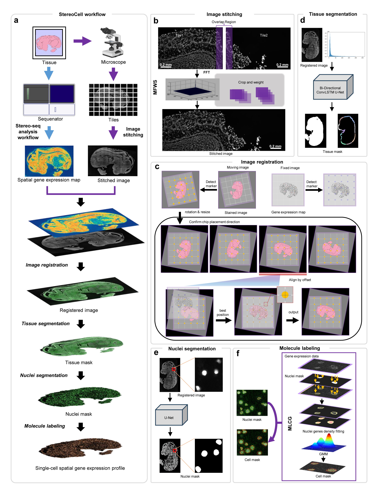
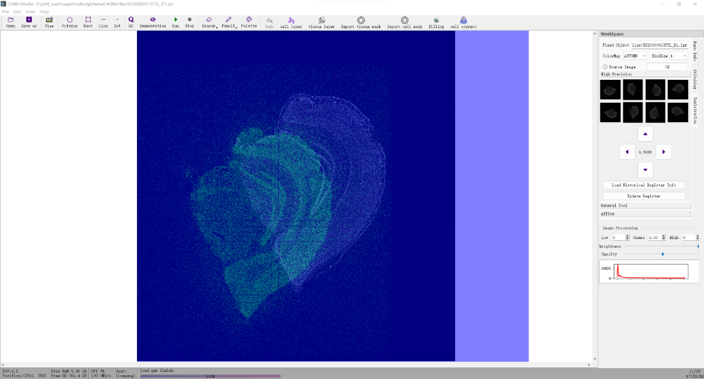

[](https://img.shields.io/github/stars/STOmics/CellBin) 
[](https://www.pepy.tech/projects/cell-bin)
[](https://pypi.org/project/cell-bin/)
[](https://github.com/vanvalenlab/deepcell-tf/blob/master/LICENSE)

# CellBin

<div align="center">
  
    <h6>
      CellBin: a highly accurate single-cell gene expression generation pipeline for high resolution spatial transcriptomics.
    </h6>
</div>
<br>

## Installation
* Download the [dev branch](https://codeload.github.com/STOmics/CellBin/zip/refs/heads/dev) in CellBin repo, and install requirements.txt in a ```python==3.8``` environment.
```text
# python3.8 in conda env
conda create --name=CellBin python=3.8
conda activate CellBin
cd CellBin-dev
pip install -r requirements.txt  # install
```
* The ```pyvips``` package needs to be installed separately. The following is referenced from [pyvips](https://libvips.github.io/pyvips/README.html#non-conda-install)

**On Windows**, first you need to use pip to install like,
```text
$ pip install --user pyvips==2.2.1
```
then you need to download the compiled library from [vips-dev-8.12](https://github.com/libvips/libvips/releases),
To set PATH from within Python, you need something like this at the start:

```python
import os
vipshome = 'c:\\vips-dev-8.7\\bin'
os.environ['PATH'] = vipshome + ';' + os.environ['PATH']
```

**On Linux**,
```text
$ conda install --channel conda-forge pyvips==2.2.1
```
* Download the weight files and transfer them to the specified path (if the path does not exist, you can manually create the new folders).<br>

| weight file                                                                                          | specified path                               |
|------------------------------------------------------------------------------------------------------|---------------------------------------|
| [sold2_wireframe.tar](https://bgipan.genomics.cn/#/link/CU7nnrRvAYZKoZpYWvuB) , PWD: nJY4                | cellbin\iqc\trackCross_net\sold2\ckpt |
| [stereocell_bcdu_cell_256x256_220926.pth](https://bgipan.genomics.cn/#/link/CU7nnrRvAYZKoZpYWvuB) , PWD: nJY4     | cellbin\weights                       |
| [stereocell_bcdu_tissue_512x512_220822.onnx](https://bgipan.genomics.cn/#/link/CU7nnrRvAYZKoZpYWvuB), PWD: nJY4   | cellbin\weights                       |


## Tutorials

### Test Data
Here is a mouse brain data set, which is generated by BGI STOmics. 
You only need to download the spatial gene expression data [S200000135TL_D1.gem.gz](https://bgipan.genomics.cn/#/link/HvMV45HgXkseepQo0AoO) (PWD: FMYk) and tiles [SS200000135TL_D1.tif.gz](https://bgipan.genomics.cn/#/link/Jchp46A3HfrTVZymKkRF) (PWD: n2Ge). 
We recommend creating a new "data" folder under CellBin-dev, and decompressing "SS200000135TL_D1.tif.gz" to this folder. 
"S200000135TL_D1.gem.gz" does not need to be decompressed.<br>

The purpose of open-sourcing this data set is to promote the research of spatial single-cell data in the field of life 
sciences through algorithms. STOmics reserves the right to interpret it.

### Command Line
You can perform CellBin in one-stop, or perform [image quality control, image stitching, image registration, tissue segmentation, nuclei segmentation, nuclei mask filtering and molecule labeling](docs/modules.md) independently.

CellBin in one-stop is performed by command:

* ```--tiles_path```  The path of all tiles.
* ```--gene_exp_data``` The compressed file of spatial gene expression data.
* ```--output_path``` The output path.
* ```--chip_no``` Chip number of the Stereo-seq data. 

```shell
cd scripts

# CellBin
python cellbin.py
--tiles_path /data/SS200000135TL_D1
--gene_exp_data /data/SS200000135TL_D1.gem.gz
--output_path /data/result
--chip_no SS200000135TL_D1
```
[More about output](docs/details.md)

### GUI
For some low-quality input data, using the CellBin pipeline will get wrong results. We have developed a manual tool 
based on [pyqt5](https://pypi.org/project/PyQt5/) to adapt to this scenario, you can get it through the [cloud disk](https://bgipan.genomics.cn/#/link/qn9MVeFkbSl4i6ULSUvW) (PWD: 6bnz) . 
We have sorted out the details of installation and operation into the [User Manual](docs/CellbinStudio_Manual_20221212.pdf), which will help you get started quickly.
The Mainwindow is shown in the figure below,
<div align="center">
  
    <h6>
      Fig 1 Main window of CellBinStudio
    </h6>
</div>

## License and Citation <br>
CellBin is released under the MIT license. Please cite SCellBin in your publications if it helps your research: <br>
```text
@article {Li2023.02.28.530414,
	author = {Li, Mei and Liu, Huanlin and Li, Min and Fang, Shuangsang and Kang, Qiang},
	title = {CellBin enables high accuracy single cell segmentation for spatial transcriptomic dataset},
	year = {2023},
	URL = {https://www.biorxiv.org/content/early/2023/03/01/2023.02.28.530414},
	journal = {bioRxiv}
}
```

    
## Reference <br>
> https://github.com/matejak/imreg_dft <br>
> https://github.com/rezazad68/BCDU-Net <br>
> https://github.com/libvips/pyvips <br>
